# 💳 SubSync V13

<p align="center">
  
  
  
  
  
</p>

<p align="center">
  <b>Gestor de suscripciones personales 100% offline. Zero backend, base de datos SQL en el navegador.</b>
</p>

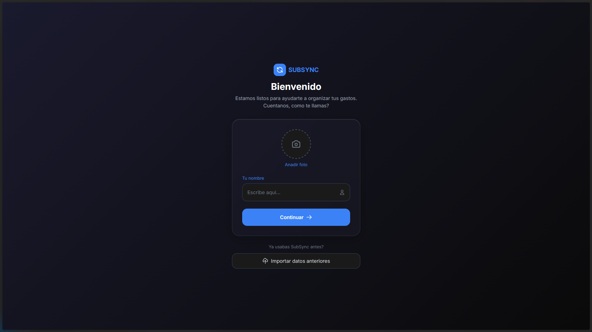

## 🚀 Demo en Vivo

👉 **[Ver Demo en GitHub Pages](https://erick-ante.github.io/subsync/)**

## ✨ Características Principales

- 💾 **Base de datos SQLite real** en el navegador vía WebAssembly
- 🗄️ **Persistencia avanzada**: IndexedDB + compresión LZ-String (supera límite de 5MB)
- 📅 **Calendario visual**: Fechas de cobro con indicadores mensuales
- 🤝 **Suscripciones compartidas**: Divide gastos y calcula tu parte automáticamente
- 📊 **Dashboard analítico**: Gastos por categoría, próximos pagos, totales mensuales
- 🎨 **UI Moderna**: Glassmorphism, tema claro/oscuro, transiciones fluidas
- 📱 **Diseño 100% Responsive**: Mobile-first con Tailwind CSS
- 🔄 **Import/Export**: Respalda datos en JSON, migración entre dispositivos
- 🛡️ **Seguridad**: Sanitización XSS completa en todas las entradas

## 🛠️ Stack Tecnológico

| Tecnología | Implementación |
|------------|----------------|
| **SQL.js** | SQLite 3.40+ compilado a WebAssembly para queries complejas |
| **IndexedDB** | Almacenamiento persistente de la base de datos comprimida |
| **LZ-String** | Compresión de datos (~60% reducción de tamaño) |
| **Tailwind CSS** | Diseño utility-first, modo oscuro/claro |
| **Vanilla JS** | ES6+, Patrón Módulo, Async/Await |
| **Canvas API** | Redimensión y compresión de imágenes client-side |


## 💻 Vistas del Proyecto en Desktop
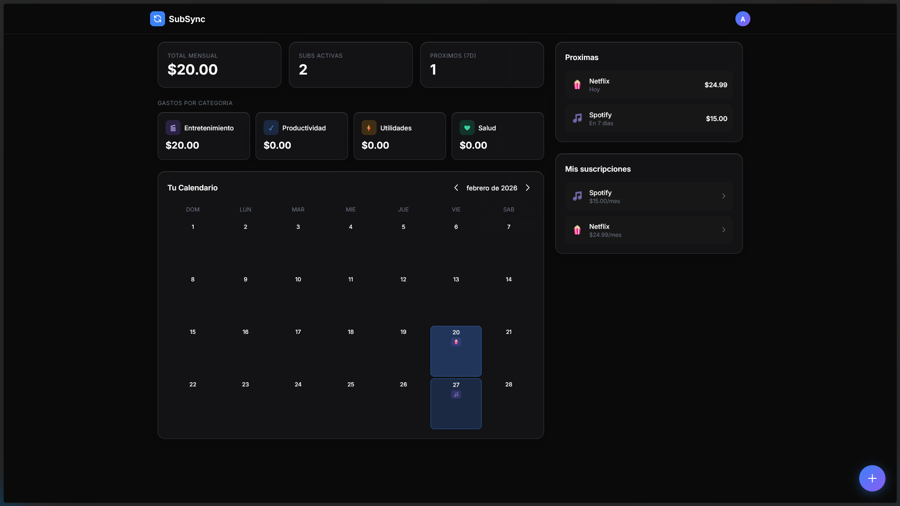
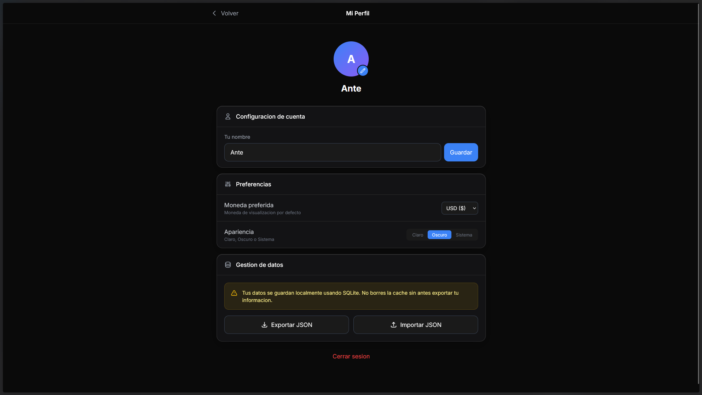
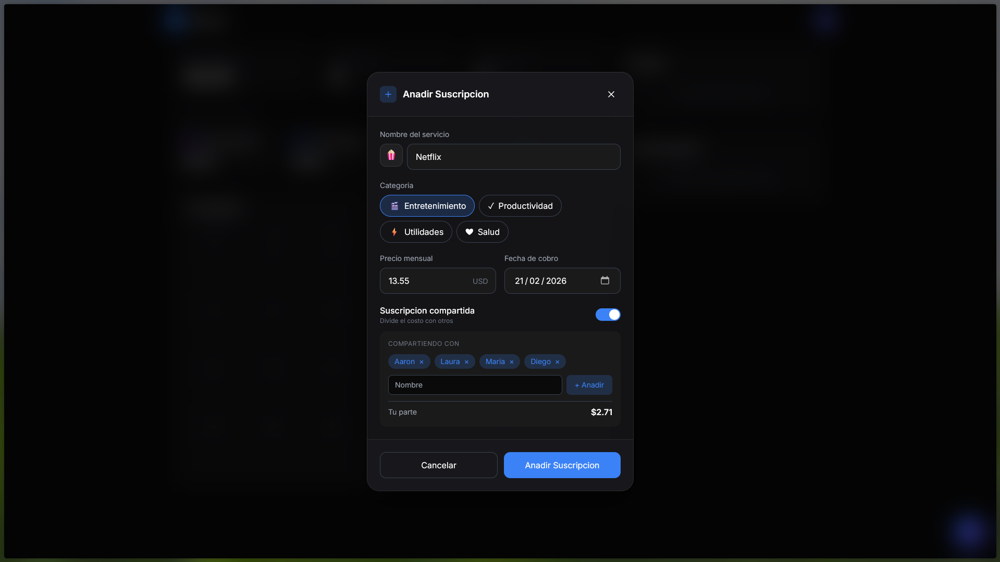
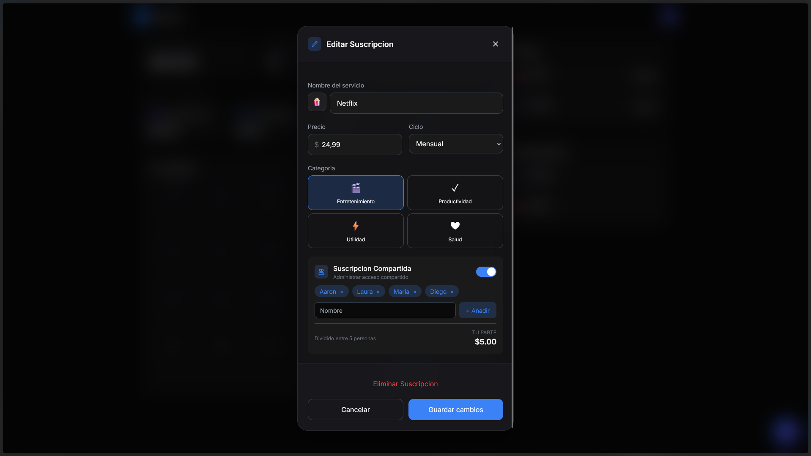


## 💻 Vistas del Proyecto en Desktop (Modo claro)
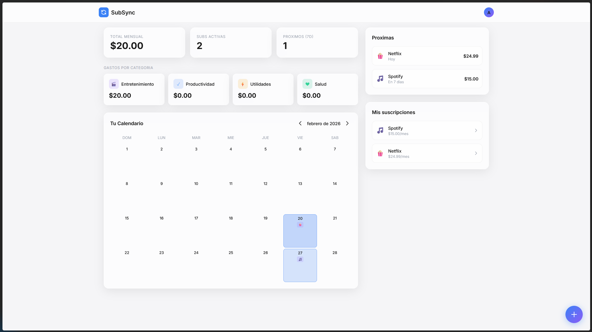
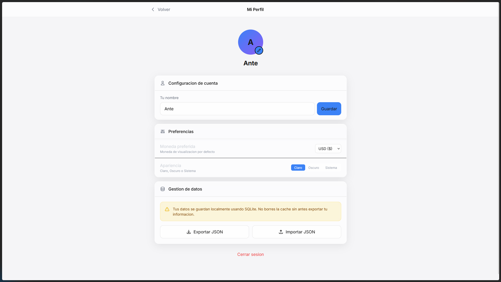

## 📱 Vistas del Proyecto en Mobile
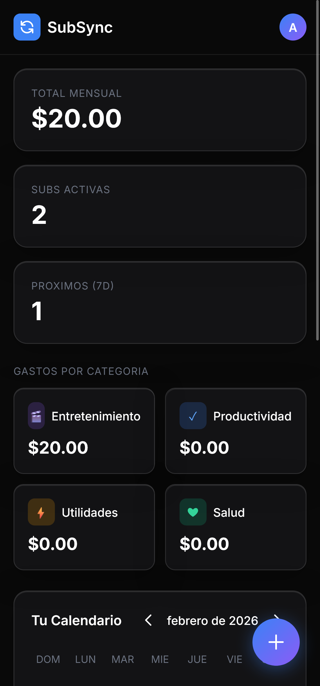
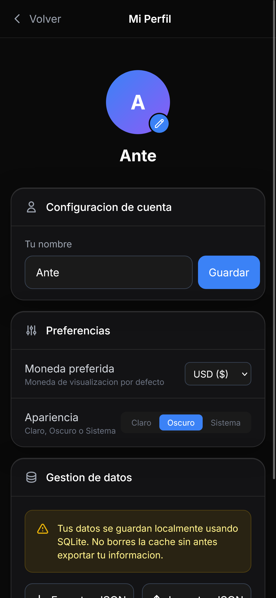
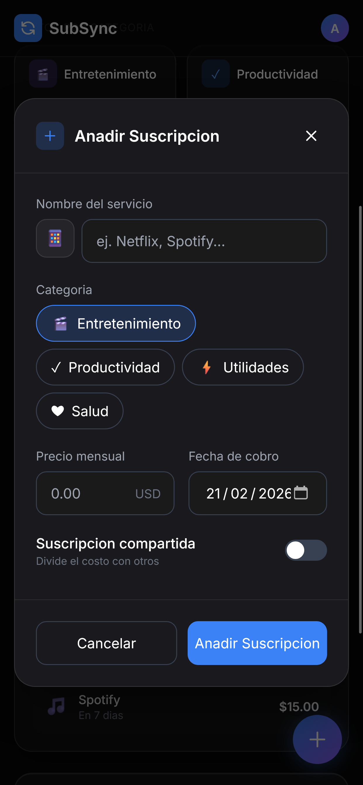
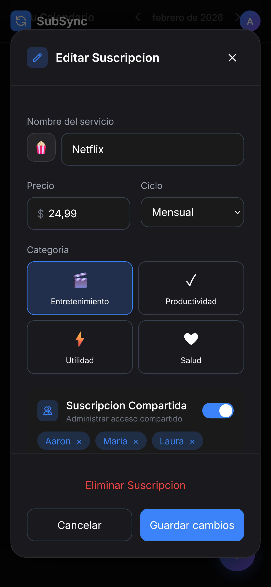
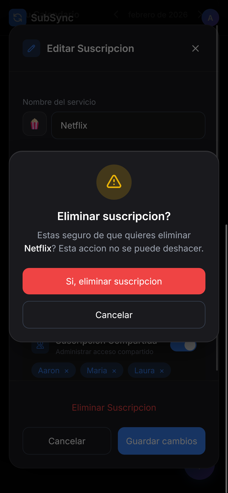

## 🎯 Funcionalidades Detalladas

### 💰 Gestión de Suscripciones
- CRUD completo de suscripciones (Netflix, Spotify, etc.)
- Categorías automáticas: Entretenimiento, Productividad, Salud, Utilidades
- Cálculo inteligente de costos compartidos (división equitativa)
- Recordatorios de pagos próximos (7 días)
- Historial persistente con SQLite (ACID compliance)

### 🗄️ Arquitectura de Datos
- **Base de datos relacional**: Tablas normalizadas (user, subscriptions, shared_people)
- **Compresión LZ-String**: Reduce tamaño de datos antes de guardar en IndexedDB
- **Optimización de imágenes**: Fotos de perfil redimensionadas a 200x200px (<100KB)
- **Migración automática**: Detecta datos antiguos en localStorage y migra a IndexedDB

### 🎨 UX/UI Avanzada
- **Temas dinámicos**: Detección automática del sistema (prefers-color-scheme)
- **Glassmorphism**: Efectos de blur y transparencia en modales
- **Calendario interactivo**: Navegación por meses, vista de días con cobros
- **Validación básica**: Alertas y control de errores al guardar en formularios
- **Gestión visual**: Interfaz clara con separación semántica de categorías

## 🚀 Instalación y Uso Local

```bash
# Clonar repositorio
git clone https://github.com/erick-ante/SubSync.git
cd SubSync

# Abrir (opción 1 - Live Server recomendado)
# Instala extensión "Live Server" en VS Code y click derecho en index.html

# Abrir (opción 2 - Python)
python -m http.server 8000

# Abrir (opción 3 - Node)
npx http-server

Nota: Requiere servidor local (CORS policy para WebAssembly). No funciona abriendo el archivo directamente (file://).
🗂️ Estructura del Proyecto
Text
Copy

SubSync/
├── index.html              # Estructura principal y modales
├── css/
│   └── styles.css          # Estilos custom + variables de tema
├── js/
│   ├── db.js               # Lógica SQLite + IndexedDB + LZ-String
│   ├── app.js              # Controladores principales y estado global
│   ├── ui.js               # Renderizado de componentes y DOM
│   └── utils.js            # Helpers, formateo de moneda, fechas
├── screenshots/            # Capturas de la interfaz para README
└── .gitignore

⚠️ Nota Técnica (Arquitectura)
Este proyecto es una demostración de aplicación web progresiva sin backend:

    Zero servidor: Todo el procesamiento ocurre en el cliente
    SQLite en memoria: La base de datos vive en un Uint8Array en RAM
    Persistencia limitada: Los datos se guardan en IndexedDB del navegador (puede borrarse al limpiar caché)
    Sin sincronización cloud: Los datos no se comparten entre dispositivos automáticamente
    Uso de import/export: Para backups o migrar a otro dispositivo, usar la función de exportar JSON

🎓 Aprendizaje del Proyecto
Proyecto personal desarrollado para demostrar:

    WebAssembly en producción: Integración de sql.js para queries SQL complejas en el frontend
    Storage avanzado: Migración de localStorage a IndexedDB con compresión
    Optimización de performance: Redimensión automática de imágenes localmente con Canvas
    Diseño responsive: Mobile-first con Tailwind, temas dinámicos
    Arquitectura sin frameworks: Gestión de estado vanilla, patrón módulo, async/await

📝 Licencia
MIT License - Proyecto personal
```
